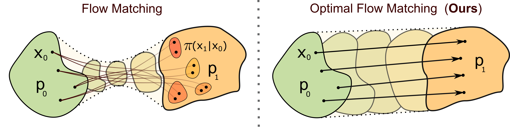

# Optimal Flow Matching

This repository contains **code** for the experiments of NeurIPS 2024 paper [Optimal Flow Matching: Learning Straight Trajectories in Just One Step](https://openreview.net/pdf?id=kqmucDKVcU) by [Nikita Kornilov](https://scholar.google.com/citations?user=zvQZigsAAAAJ&hl=en), [Petr Mokrov](https://scholar.google.com/citations?user=CRsi4IkAAAAJ&hl=en), [Alexander Gasnikov](https://scholar.google.ru/citations?user=AmeE8qkAAAAJ&hl=en) and [Alexander Korotin](https://scholar.google.ru/citations?user=1rIIvjAAAAAJ&hl=en). 

We propose novel **Optimal Flow Matching** (OFM) method which extends conventional Flow Matching algorithm for specific "optimal" parameterization of transport ODE vector field.

<span style="color:green">**Pros. of our method**: </span>
* OFM recovers <u>straight</u> trajectories between source and target distributions in just <u>one</u> Flow Matching step.
* OFM solves quadratic <u>Optimal Transport</u> problem between source and target distributions.

<span style="color:red">**Cons. of our method**: </span>
* OFM is based on rather complex training procedure (with auxiliary optimization step).
* OFM relies on [Input Convex NNs](https://proceedings.mlr.press/v70/amos17b/amos17b.pdf) which have questionable scalability.

<p align="center"></p>

## Working with the repository.

The notebooks for Illustrative 2D <u>*Gaussian*->*Eight Gaussians*</u> experiments:

```bash
.\ofm_notebooks\toy8gau_*.ipynb
```

The script for <u>Wasserstein-2 benchmark</u>:

```bash
.\ofm_scripts\bench_script.py
```
Before running this scripts place the checkpoints from the [W2 benchmark](https://openreview.net/pdf?id=CI0T_3l-n1) github repository [folder](https://github.com/iamalexkorotin/Wasserstein2Benchmark/tree/main/benchmarks/Mix3toMix10) in the folder `.\benchmarks\Mix3toMix10`.

The notebooks for <u>ALAE experiment</u>:

```bash
.\ofm_notebooks\alae_*.ipynb
```

Before running ALAE notebooks, have a look at the `./ALAE' folder (e.g. some packages need to be installed).

## Citation

If you find this repository or the ideas presented in our paper useful, please consider citing our paper.

```
@inproceedings{
    kornilov2024optimal,
    title={Optimal Flow Matching: Learning Straight Trajectories in Just One Step},
    author={Nikita Maksimovich Kornilov and Petr Mokrov and Alexander Gasnikov and Alexander Korotin},
    booktitle={The Thirty-eighth Annual Conference on Neural Information Processing Systems},
    year={2024},
    url={https://openreview.net/forum?id=kqmucDKVcU}
}
```
